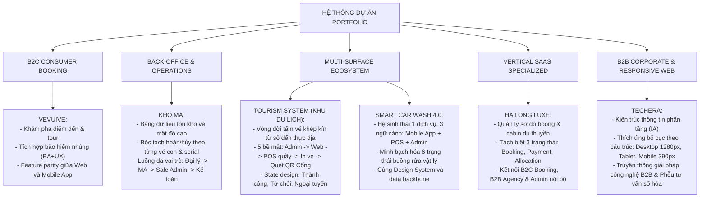

# CodeGraph Master Knowledge Base — Portfolio Nguyen Xuan Hau
> **Tài liệu trung tâm về kiến trúc, hệ sinh thái sản phẩm và liên kết mã nguồn (CodeGraph) của toàn bộ dự án Portfolio.**  
> *Mục đích: Lưu trữ toàn bộ bức tranh tổng quan dự án để bất kỳ AI model hoặc developer nào vào đọc đều nắm bắt 100% ngữ cảnh mà không cần hỏi lại.*

---

## 🧭 1. Danh Mục Toàn Bộ 7 Dự Án (Portfolio Projects Registry)

| # | Slug Kỹ Thuật | Tên Dự Án Hiển Thị | Phân Loại Danh Mục | Nền Tảng (Platforms) | Thư Mục Tài Sản (Assets) | Tài Liệu Chi Tiết |
| :-: | :--- | :--- | :--- | :--- | :--- | :--- |
| **01** | `ha-long-luxe` | **Ha Long Luxe** — Cruise Booking & Operations | `Vertical SaaS` | B2C Web, B2B Agency, Admin, Mobile | `public/projects/ha-long-luxe/` | [ha-long-luxe.md](file:///d:/Code/Profile/Portfolio/.codegraph/ha-long-luxe.md) |
| **02** | `vevuive` | **VEVUIVE** — Web & Mobile Booking Platform | `Travel & Booking` | Web, Mobile App, Admin | `public/projects/vevuive/` | [vevuive.md](file:///d:/Code/Profile/Portfolio/.codegraph/vevuive.md) |
| **03** | `ma-warehouse` | **Kho MA** — Ticket Inventory & Refund Operations | `Internal Operations` | Desktop Admin UI | `public/projects/kho-ma/` | [kho-ma.md](file:///d:/Code/Profile/Portfolio/.codegraph/kho-ma.md) |
| **04** | `tourism-omnichannel` | **Tourism System** — Booking, Ticketing & On-site Operations | `Travel & Booking` | Admin, Web Booking, POS, Ticket, Check-in | `public/projects/khu-du-lich/` | [tourism-system.md](file:///d:/Code/Profile/Portfolio/.codegraph/tourism-system.md) |
| **05** | `insurance-integration` | **Insurance Integration** — Mobile Purchase & Policy Experience | `Mobile & InsurTech` | Mobile App (iOS / Android), Policy Management | `public/projects/insurance/` | [insurance-integration.md](file:///d:/Code/Profile/Portfolio/.codegraph/insurance-integration.md) |
| **06** | `smart-car-wash` | **Smart Car Wash 4.0** — Customer App · POS · Operations | `Multi-Surface Platform` | Customer Mobile App, POS Terminal, Admin Portal | `public/projects/smart-car-wash/` | [smart-car-wash.md](file:///d:/Code/Profile/Portfolio/.codegraph/smart-car-wash.md) |
| **07** | `corporate-website` | **TECHERA** — Corporate Technology Website | `B2B Corporate Web` | Desktop (1280px), Tablet (768–900px), Mobile (390px) | `public/projects/corporate-website/` | [corporate-website.md](file:///d:/Code/Profile/Portfolio/.codegraph/corporate-website.md) |

---

## 🏗️ 2. So Sánh Bản Chất Các Dự Án Trọng Điểm (Differentiator Matrix)

Để tránh lặp lại câu chuyện thiết kế giữa các dự án:



---

## 🗂️ 3. Kiến Trúc Cấu Trúc Mã Nguồn (Codebase Architecture)

```
Portfolio/
├── .agents/
│   └── rules/
│       └── codegraph_auto_sync.md          # Quy tắc bắt buộc tự động cập nhật CodeGraph
├── .codegraph/                             # Thư mục lưu trữ toàn bộ tài liệu kiến trúc (CodeGraph)
│   ├── README.md                           # File này: Tổng quan & Chỉ mục trung tâm
│   ├── ha-long-luxe.md                     # Chi tiết dự án Ha Long Luxe
│   ├── vevuive.md                          # Chi tiết dự án Vevuive
│   ├── kho-ma.md                           # Chi tiết dự án Kho MA
│   ├── tourism-system.md                   # Chi tiết dự án Tourism System
│   ├── insurance-integration.md            # Chi tiết dự án Insurance Integration
│   ├── smart-car-wash.md                   # Chi tiết dự án Smart Car Wash
│   └── corporate-website.md                # Chi tiết dự án Corporate Website (TECHERA)
│
├── public/
│   └── projects/                           # Chứa tài sản hình ảnh trích xuất từ Figma thật
│       ├── ha-long-luxe/                   # 13 ảnh WebP
│       ├── vevuive/                        # 15 ảnh WebP
│       ├── kho-ma/                         # 13 ảnh WebP
│       ├── khu-du-lich/                    # 12 ảnh WebP
│       ├── insurance/                      # 13 ảnh WebP (Mobile Insurance)
│       ├── smart-car-wash/                 # 29 ảnh WebP & PNG (Mobile, POS, Admin, Design System)
│       └── corporate-website/              # 21 ảnh WebP & PNG (Desktop, Tablet, Mobile, Services, Form)
│
├── src/
│   ├── data/
│   │   ├── projectsData.js                 # Dữ liệu gốc: cấu trúc dự án, nội dung các chương, mảng ảnh
│   │   ├── projectsI18n.js                 # Bản dịch Tiếng Việt (vi) & Tiếng Anh (en) + Captions gallery
│   │   └── portfolioData.js                # Danh mục, filter mapping, fallback cover suppression (null)
│   │
│   ├── pages/
│   │   ├── CaseStudyPage.jsx               # Render chi tiết từng Case Study (theo 6-8 problem-oriented chapters)
│   │   └── WorkPage.jsx                    # Trang danh mục toàn bộ dự án với bộ lọc chuyên sâu
│   ├── components/
│   │   ├── ProjectModal.jsx                # Modal xem nhanh dự án (có nhánh render chuyên sâu từng slug)
│   │   ├── ImageLightboxModal.jsx          # Lightbox phóng to/thu nhỏ ảnh tương tác (Zoom In/Out, Pan, Reset, Counter, Gallery Nav)
│   │   ├── Bi.jsx                          # <Bi vi en/>: render cả 2 ngôn ngữ chung 1 ô grid -> đổi VI/EN KHÔNG nhảy layout
│   │   ├── ProjectImage.jsx                # Hiển thị ảnh kèm preview và kích hoạt click-to-zoom
│   │   ├── Portfolio.jsx                   # Card dự án trên trang chủ
│   │   └── Navbar.jsx, Hero.jsx, About.jsx, CareerJourney.jsx, WorkProcess.jsx, Services.jsx, Contact.jsx, Footer.jsx
```

---

## 🎨 4. Hệ Thống Màu Sắc & Cấu Trúc Trang Chủ (Visual Color System & 4-Section Layout)

### 4.1. Hệ màu chuẩn mực SaaS / Enterprise (Navy + Orange + Light Neutral)
- **Primary Navy:** `#0E2A47` (Header, Dark Section, Footer, Typography chính)
- **Secondary Navy:** `#163E63` (Borders, card hover, divider)
- **Accent Orange:** `#FF7A00` (CTA chính, tag điểm nhấn, active navigation, icon spotlight)
- **Orange Hover:** `#E96800`
- **Orange Light Background:** `#FFF2E6` (viền `#FFD4B2` cho badge và chip)
- **Main Background:** `#F8FAFC` (70% diện tích trang)
- **Surface / Card:** `#FFFFFF` (viền `#D9E2EC`, shadow mềm)
- **Text:** `#102A43` (Primary), `#627D98` (Secondary / Body)

### 4.2. Hệ Thống Typography Chuẩn Hóa Toàn Diện (Montserrat Only)
Toàn bộ website sử dụng **Montserrat** (`"Montserrat", Arial, sans-serif`), không pha trộn font khác:
- **Font Weights:** `400 Regular`, `500 Medium`, `600 SemiBold`, `700 Bold` (Không dùng 800/900).
- **Tokens Chính:**
  - `Display XL`: 64px / 72px / 700 / letter-spacing: -0.035em (Mobile: 40/48, Tablet: 52/60)
  - `Display`: 52px / 62px / 700 / letter-spacing: -0.03em (Mobile: 36/44, Tablet: 44/54)
  - `H1`: 44px / 54px / 700 / letter-spacing: -0.025em (Mobile: 32/40, Tablet: 38/48)
  - `H2`: 36px / 46px / 700 / letter-spacing: -0.02em (Mobile: 28/36, Tablet: 32/42)
  - `H3`: 28px / 38px / 600 / letter-spacing: -0.015em (Mobile: 22/30, Tablet: 26/34)
  - `H4`: 20px / 30px / 600 (Mobile: 18/27)
  - `Lead`: 18px / 30px / 500 (Mobile: 17/28; max-width: 48–56ch)
  - `Body`: 16px / 28px / 400 (Mobile: 16/27; max-width: 58–65ch; không bao giờ dưới 16px trên mobile)
  - `Body Strong`: 16px / 26px / 600
  - `Small`: 14px / 23px / 400–500 (Mobile: 14/22)
  - `Label`: 13px / 20px / 500
  - `Caption`: 12px / 19px / 500 (Mobile: 12/18; không bao giờ dưới 12px trên desktop)
  - `Eyebrow`: 12px / 18px / 600 uppercase, letter-spacing: 0.08em
  - `Button`: 15px / 22px / 600
  - `Navigation`: 14px / 22px / 500
- **Case Study Specifics:**
  - `Case Title`: 44px / 54px / 700 / letter-spacing: -0.025em
  - `Subtitle`: 18px / 30px / 400–500
  - `Major Section`: 28px / 38px / 700
  - `Subsection`: 20px / 30px / 600
  - `Body`: 15px / 26px / 400
  - `Supporting Body`: 14px / 23px / 400
  - `Metadata`: 12px / 19px / 500

### 4.3. Cấu trúc 8 Khối Trang Chủ Chuẩn Phase 2 (Redesign Sequence theo Mockup)
Trang chủ tuân thủ trình tự dòng chảy dẫn dắt tuyển dụng (Product Designer Storytelling Flow):
1. **01 HERO (`Hero.jsx`):** Lời chào cá nhân, định vị chuẩn **Business Analyst & UI/UX Designer**, nút CTA dạng viên thuốc (`Xem dự án của tôi →`, `Tải CV`), dải 3 chỉ số (`3+ Năm kinh nghiệm`, `20+ Dự án`, `100% Tập trung giá trị người dùng`), thẻ chân dung kèm hiệu ứng hào quang, watermark `XH`, ghi chú viết tay *"Biến nghiệp vụ phức tạp thành trải nghiệm đơn giản"* và badge `Product Thinker · User-Centered Designer`.
2. **02 BA → UX THINKING (`About.jsx`):** *"Nơi Business Logic Trở Thành Product Experience"* — Sơ đồ kết nối tư duy 3 cột: Cột trái `BUSINESS LOGIC` (6 hạng mục nghiệp vụ), Cột giữa cầu nối `BA - Phân tích` / `UX - Thiết kế` kết nối tạo nên sản phẩm tốt hơn, Cột phải `PRODUCT EXPERIENCE` (6 hạng mục trải nghiệm giao diện), kèm 3 nguyên tắc thiết kế thực tế (`Hiểu đúng nghiệp vụ`, `Thiết kế lấy người dùng làm trung tâm`, `Tạo ra giá trị thực tế`).
3. **03 CAPABILITIES (`Services.jsx`):** Bố cục 3 cột trực quan (`Product & UI/UX Design`, `Business Analysis & System Thinking`, `Tools & Workflow` kèm icon công cụ thực tế Figma, Jira, Confluence, VS Code, Slack, Miro...).
4. **04 CAREER / EXPERIENCE (`CareerJourney.jsx`):** Timeline tiến trình nằm ngang (Horizontal Connected Progression) với trục nối xuyên suốt 4 cột mốc từ Thực tập sinh Product/BA → Business Analyst → UI/UX Designer → BA & UI/UX Designer hiện tại, kèm nút `Xem full CV →`.
5. **05 FEATURED PROJECTS (`Portfolio.jsx`):** 3 dự án tiêu biểu trọng điểm ở bố cục báo chí biên tập (Editorial Grid) kích thước lớn với ảnh UI thật 16:10, metadata và liên kết `Xem chi tiết →`. Nhấp vào dự án sẽ kích hoạt **Route-Backed Full-Screen Modal Overlay** thay vì chuyển trang thô bạo. Có nút xem toàn bộ 7 dự án kèm filter tab.
6. **06 WORK PROCESS (`WorkProcess.jsx`):** Quy trình làm việc 6 bước kết nối nằm ngang (`01 Khám phá & Hiểu vấn đề` → `02 Phân tích & Làm rõ yêu cầu` → `03 Thiết kế giải pháp` → `04 Thiết kế chi tiết & Prototyping` → `05 Kiểm thử & Tối ưu` → `06 Triển khai & Đo lường giá trị`).
7. **07 COLLABORATION CTA (`CtaBanner.jsx`):** Thẻ xanh navy sẫm (`#081B2E`) bo góc lớn 24px, thông điệp kêu gọi hợp tác kèm mũi tên cam uốn lượn chỉ vào nút `Liên hệ với tôi →`.
8. **08 CONTACT (`Contact.jsx`):** 3 kênh liên hệ trực tiếp dạng cột (`Email`, `LinkedIn`, `Message` / SĐT) và danh sách CV tải về.

### 4.4. Cơ Chế Route-Backed Full-Screen Case Study Modal Overlay (`CaseStudyOverlay.jsx`)
- **Tương tác cốt lõi:** Khi người dùng click vào card dự án hoặc nút *"Xem chi tiết"*, dự án mở ra bên trong một lớp phủ Modal Overlay toàn màn hình hiển thị đè lên trên trang chủ:
  - **Desktop:** Kích thước `min(92vw, 1440px)` x `92dvh`, bo góc `rounded-3xl`, bóng đổ mềm `shadow-2xl`, hiển thị giữa màn hình với nền phủ navy mờ `bg-[#081B2E]/75 backdrop-blur-md`.
  - **Mobile:** Tràn màn hình `100vw` x `100dvh`, bo góc 0, tối ưu thanh điều hướng dính trên đầu trang.
  - **Khóa cuộn trang nền:** Trang chủ bên dưới bị khóa cuộn (`overflow: hidden`), nội dung Case Study cuộn độc lập bên trong modal.
  - **Bảo toàn vị trí cuộn:** Khi đóng modal (bằng nút `Đóng` [×], phím `ESC`, hoặc nút Back trình duyệt), modal biến mất và người dùng trở lại đúng vị trí cuộn trang chủ trước đó, không bị nhảy lên đầu trang.
  - **URL thân thiện & Chia sẻ (Route-Backed):** URL tự động cập nhật sang `/work/:slug` khi mở modal. Người dùng có thể sao chép link chia sẻ trực tiếp cho nhà tuyển dụng; khi mở link độc lập, ứng dụng tự động dựng trang chủ bên dưới và mở ngay Case Study Modal lên trên.
  - **Chuyển đổi liên tục giữa các dự án:** Nút `PREVIOUS PROJECT` và `NEXT PROJECT` ở đầu thanh dính và cuối trang modal chuyển đổi mượt mà giữa các dự án mà không đóng modal hay tải lại trang.

---

## 🛡️ 5. Quy Tắc Cốt Lõi Khi Làm Việc Với Codebase

1. **Tuyệt đối không dùng ảnh stock Unsplash:** Các dự án đã có ảnh Figma thật (`domainFallbackCovers` = null).
2. **Không bịa số liệu ảo (fake metrics):** Không tự đưa ra các con số % tăng trưởng, conversion rate hoặc ROI không có trong tài liệu.
3. **Giữ nguyên Slug kỹ thuật:** Không thay đổi các slug: `ha-long-luxe`, `vevuive`, `ma-warehouse`, `tourism-omnichannel`, `insurance-integration`, `smart-car-wash`, `corporate-website`.
4. **Bảo toàn hiển thị Role & Metadata:** Không dùng `truncate` gây che khuất thông tin vai trò (Role), nền tảng (Platforms) trong card và modal.
5. **Tương tác hình ảnh:** Toàn bộ ảnh sản phẩm hỗ trợ xem chi tiết với Interactive Lightbox (Zoom In/Out, Pan mượt mà mọi góc không bị đóng modal khi thả chuột nhờ chặn synthetic click propagation, Gallery Prev/Next, Phím tắt Esc/Arrow, Double Click 1x/2x).
6. **Luôn cập nhật CodeGraph:** Mỗi lần sửa đổi bất kỳ dự án nào, phải cập nhật file tương ứng trong `.codegraph/`.

7. **Chuyển ngôn ngữ không được nhảy layout:** Mọi text song ngữ trong trang chủ dùng `<Bi vi="..." en="..." />` (`src/components/Bi.jsx`, CSS `.bi` trong `index.css`) thay vì `{isVi ? a : b}`; text trong mảng dữ liệu (name/title/desc/role...) cũng là `<Bi/>`. Không dùng các giá trị này làm `key`/`alt`/`aria-*`. Kiểm tra: chiều cao trang VI = EN ở 1440/1024/390.
8. **Cỡ chữ (bản tăng 2026-10):** `tailwind.config.js` override `text-xs`=14px, `text-sm`=16px, `text-base`=17px; token `.typo-*` tăng ~2px (caption/eyebrow 14, small 16, body 18, lead 20). Không dùng `text-[<13px]`. Chỉ Montserrat, không dùng `font-mono` (dùng `tabular-nums`).
9. **Hero stats trung thực:** `3+` năm, `7` dự án thực tế, `BA → UX` (không dùng "20+ dự án"/"100%").
10. **Song ngữ nội dung dự án (VI hoàn toàn / EN hoàn toàn):** dữ liệu gốc `projectsData.js` giữ nguyên; bản dịch từng leaf string nằm ở `src/data/caseI18n/<slug>.json` (`{ "<path>": {vi,en} }`), áp dụng qua `useProjects()` trong `src/data/localizeProjects.js`. Chuỗi cứng trong `CaseStudyPage.jsx` dùng `tt("...")` tra `src/data/uiI18n.json`. Thêm/sửa nội dung case study → cập nhật cả hai file JSON (vi + en), không để chuỗi lẫn ngôn ngữ.
11. **Icon:** không dùng `Sparkles` kiểu "AI". Eyebrow dùng icon theo ngữ cảnh (PenTool, GitMerge, LayoutGrid, Route, FolderKanban, Workflow, MessageCircle). Favicon: `public/favicon.svg` (XH cam `#FF7A00`).
12. **Career thật:** HPT Vietnam (06–09/2023, DB/Data intern) → IS Group (07/2024–02/2025, BA) → DOTB (10/2025–01/2026, BA EdTech) → Techera (02/2026–nay, UIUX). Kinh nghiệm: 1+ năm BA, ~1 năm UI/UX.
13. **Rà soát UI cuối (2026-10):** nhãn dạng pill trong case study dùng `rounded-2xl` (không `rounded-full`) để xuống dòng vẫn đẹp; không `truncate` metadata; thẻ dự án trang chủ chỉ hiện 1 badge `productType` (chữ thường) + năm; bản dịch tiếng Việt dùng sentence case (không Title Case). Kiểm tra bằng Playwright: chiều cao trang VI = EN ở 1440/1280/1024/768/390, không overflow ngang.
