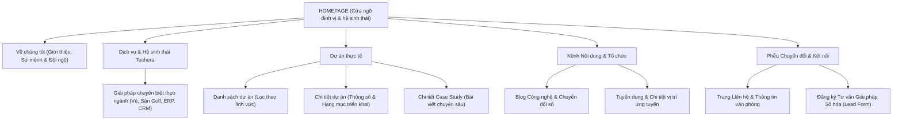

# TECHERA — Corporate Technology Website
> **CodeGraph & Project Knowledge Base**  
> *Dự án thiết kế website doanh nghiệp đa nền tảng (Desktop 1280px, Tablet 768–900px, Mobile 390px), kiến trúc thông tin phân tầng và truyền thông hệ sinh thái giải pháp B2B.*

---

## 📌 1. Project Positioning & Value Proposition

- **Project Title:** TECHERA — Corporate Technology Website
- **Subtitle:** Responsive Corporate Website · Information Architecture · B2B Product Communication
- **Slug:** `corporate-website` (Index: `07`)
- **Role:** UI Design / UIUX Support
- **Category:** `Vertical SaaS` / B2B Corporate Presence
- **Domain:** Corporate Presence & B2B Technology Communication
- **Platforms:** Responsive Web: Desktop (1280px), Tablet (768px – 900px), Mobile (390px)
- **Source of Truth:** Figma File `quw3VbrY0atrG9YTyZRTwR`, Section *Website công ty*, Node `1952:1510`

### Bản sắc khác biệt so với các dự án khác:
- **Vevuive:** B2C Consumer Booking & Mobile Experience (Trải nghiệm đặt dịch vụ tiêu dùng).
- **Kho MA:** Phức tạp hóa luồng vận hành nội bộ (Inventory & Refund operational workflows).
- **Smart Car Wash 4.0:** Hệ sinh thái dịch vụ đa bề mặt (Customer App → POS → Admin).
- **TECHERA Website:** Thiết kế Web Thích ứng (Responsive Web Design) + Kiến trúc thông tin (Information Architecture) + Truyền thông giải pháp công nghệ B2B + Bố cục thích ứng cấu trúc trên Desktop, Tablet và Mobile.

---

## 🏗️ 2. Information Architecture & Navigation Taxonomy

---

## 📱 3. Responsive by Structure (Không đơn thuần co giãn tỷ lệ)

Giao diện thích ứng trên 3 cấp độ màn hình từ Figma nguồn:
1. **Desktop (1280px):** Bố cục lưới đa cột, thanh điều hướng Mega Menu hiển thị danh mục giải pháp toàn cảnh, bảng năng lực mật độ thông tin cao.
2. **Tablet (768px – 900px):** Tái cấu trúc thành 2 cột, tối ưu khoảng chạm (touch-friendly targets), giản lược lề phụ.
3. **Mobile (390px):** Ngăn xếp 1 cột dọc (single-column stacking), thanh điều hướng thu gọn dạng Drawer/Menu, nút bấm CTA bám sát vùng ngón cái (Thumb-zone).

---

## 📸 4. Thư Mục Tài Sản Thực Tế (Figma Real UI Exports)

Thư mục lưu trữ: [`public/projects/corporate-website/`](file:///d:/Code/Profile/Portfolio/public/projects/corporate-website/)

| Tệp Hình Ảnh | Định Dạng | Node Figma Nguồn | Ý Nghĩa Trình Diễn Trong Case Study |
| :--- | :---: | :--- | :--- |
| `01-cover.webp` | WebP (2400x1500) | `1721:1147`, `3744:367`, `1721:1754` | Master Composite Cover: Desktop Homepage + Tablet + Mobile floating |
| `02-hero.webp` | WebP (2560x1540) | `1721:1344` | Khu vực Hero định vị giá trị: Chuyển đổi số toàn diện cho doanh nghiệp |
| `02-homepage-full.webp` | WebP (2568x8264) | `1721:1147` | Toàn bộ giao diện trang chủ Desktop 1280px, hỗ trợ zoom lightbox |
| `03-solutions-capabilities.webp` | WebP | `1721:1385`, `1721:1259` | Tab danh mục giải pháp + Lưới năng lực nền tảng công nghệ |
| `04-services.webp` | WebP | `10191:4836`, `10191:4982` | Lưới dịch vụ chính mật độ cao + Giải pháp số hóa chuyên ngành |
| `05-projects-casestudy.webp` | WebP | `11400:841`, `11415:2582`, `2070:353` | Bố cục 3 bước: Danh mục dự án → Chi tiết dự án → Case Study dài kỳ |
| `06-responsive.webp` | WebP (2400x1500) | `1721:1147`, `3744:367`, `1721:1754` | So sánh cấu trúc hiển thị thực tế: Desktop (1280px), Tablet (800px), Mobile (390px) |
| `07-content-templates.webp` | WebP | `1969:2305`, `1969:1783`, `10129:3436` | Các mẫu trang nội dung: Blog tri thức, Chi tiết tuyển dụng và Mega Menu |
| `08-contact-consultation.webp` | WebP | `2083:1071`, `12546:2502` | Trang liên hệ văn phòng + Biểu mẫu chuyên sâu đăng ký tư vấn số hóa |

---

## 🗂️ 5. Code Mapping

- **Data Definition:** [`src/data/projectsData.js`](file:///d:/Code/Profile/Portfolio/src/data/projectsData.js) (Project `07`, slug `corporate-website`)
- **Localization:** [`src/data/projectsI18n.js`](file:///d:/Code/Profile/Portfolio/src/data/projectsI18n.js) (VI & EN)
- **Case Study Render:** [`src/pages/CaseStudyPage.jsx`](file:///d:/Code/Profile/Portfolio/src/pages/CaseStudyPage.jsx) (8 chuyên đề)
- **Fallback Guard:** [`src/data/portfolioData.js`](file:///d:/Code/Profile/Portfolio/src/data/portfolioData.js) (`'corporate-website': null` — vô hiệu hóa fallback Unsplash để cam kết 100% ảnh thật từ Figma)
