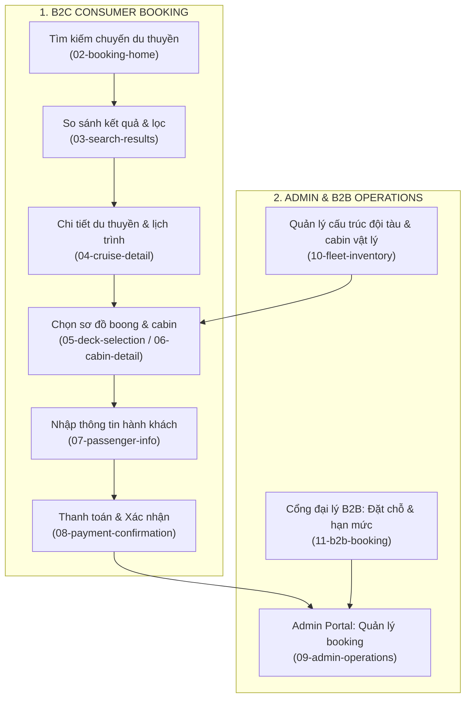

# Ha Long Luxe — Cruise Booking & Operations Platform
> **CodeGraph & Project Knowledge Base**  
> *Dự án Vertical SaaS quản lý đặt chỗ và vận hành du thuyền Hạ Long.*

---

## 📌 1. Project Positioning

- **Project Title:** HA LONG LUXE — Cruise Booking & Operations Platform
- **Slug:** `ha-long-luxe` (Index: `01`)
- **Role:** Product Designer / UIUX Designer
- **Category:** `Vertical SaaS`
- **Domain:** Tourism · Hospitality · Cruise Operations
- **Platforms:** B2C Web · B2B Agency Portal · Admin Operations · Responsive Mobile
- **Assets:** `public/projects/ha-long-luxe/` (13 ảnh WebP trích xuất từ Figma)

---

## 🏗️ 2. Business Architecture & System Logic

### 3 Trạng thái Vận hành Tách biệt (Domain Independence):
1. **Booking Status:** Trạng thái đặt chỗ (Pending, Confirmed, Cancelled, Completed).
2. **Payment Status:** Trạng thái tài chính (Unpaid, Deposit Paid, Fully Paid, Refunded).
3. **Allocation Status:** Trạng thái giữ cabin & phân bổ phòng (Unassigned, Assigned, Locked).

---

## 🗂️ 3. Code Mapping

- **Data Definition:** [`src/data/projectsData.js:L183-L504`](file:///d:/Code/Profile/Portfolio/src/data/projectsData.js#L183-L504)
- **Localization:** [`src/data/projectsI18n.js:L8-L70`](file:///d:/Code/Profile/Portfolio/src/data/projectsI18n.js#L8-L70) (VI), [`L420-L485`](file:///d:/Code/Profile/Portfolio/src/data/projectsI18n.js#L420-L485) (EN)
- **Case Study View:** [`src/pages/CaseStudyPage.jsx:L750-L980`](file:///d:/Code/Profile/Portfolio/src/pages/CaseStudyPage.jsx#L750-L980)
- **Modal View:** [`src/components/ProjectModal.jsx`](file:///d:/Code/Profile/Portfolio/src/components/ProjectModal.jsx) (`isHaLongLuxe`)
- **Assets:** `public/projects/ha-long-luxe/` (01-cover đến 13-design-qa)
