# Insurance Integration — Mobile Purchase & Policy Experience
> **CodeGraph & Architectural Knowledge Base**  
> *Dự án Trọng tâm (Featured Case Study): Tích hợp tính năng bảo hiểm du lịch phức tạp vào ứng dụng đặt vé có sẵn, hỗ trợ mua khi đặt vé, mua bổ sung sau đặt vé và quản lý vòng đời hợp đồng.*

---

## 📌 1. Project Positioning & Metadata

- **Project Title:** Insurance Integration — Mobile Purchase & Policy Experience
- **Slug:** `insurance-integration` (Index: `05`)
- **Role:** Translated insurance requirements and business rules into mobile user flows and interfaces (BA + UI/UX Contribution)
- **Domain:** Travel Insurance · Booking Platform · InsurTech
- **Platforms:** Mobile App (iOS / Android) · Supplementary Add-on Flow · Policy Management
- **Asset Directory:** `public/projects/insurance/`
- **Figma Source:**
  - File Key: `ASrpZZ44o3RPKX2UgUhBkU` (`Prj_Per`)
  - Root Node: `132918:17674` (`App Mobile new`)
  - Target Sections: `Khám phá & Đặt vé`, `Vé của tôi`, `Bảo hiểm`

---

## 🏗️ 2. Core Product Model (3 Insurance Contexts)

```mermaid
flowchart TD
    subgraph ContextA["CONTEXT A: INSURANCE DURING BOOKING"]
        A1["1. Customer Information"] --> A2["2. Insured Passenger Form"]
        A2 --> A3["3. Insurance in Order Summary"]
        A3 --> A4["4. Combined Booking Payment"]
    end

    subgraph ContextB["CONTEXT B: POST-BOOKING INSURANCE ADD-ON"]
        B1["1. Existing Paid Order ('Thêm BH')"] --> B2["2. Add Insurance Hero Screen"]
        B2 --> B3["3. Select Package (Cơ bản/Tiêu chuẩn/Cao cấp)"]
        B3 --> B4["4. Insured Person Form (Re-use data)"]
        B4 --> B5["5. Summary & Consent Checkboxes"]
        B5 --> B6["6. Supplementary Payment Screen"]
        B6 --> B7["7. Asynchronous Policy Issuing (Chờ phát hành)"]
        B7 --> B8["8. Policy Issued / Success (Thành công)"]
    end

    subgraph ContextC["CONTEXT C: DISCOVERY & POLICY MANAGEMENT"]
        C1["1. Insurance Hub Entry"] --> C2["2. Product Detail & Coverage"]
        C2 --> C3["3. Benefits, Scope & Exclusions"]
        C3 --> C4["4. Product Legal Documents"]
        C4 --> C5["5. My Policies (Active/Upcoming/Expired/Cancelled)"]
    end
```

---

## 📸 3. Real Figma Assets & Node Mapping

Tất cả hình ảnh giao diện đều được xuất trực tiếp từ file Figma thật `ASrpZZ44o3RPKX2UgUhBkU` (Scale 2.5x, chuyển đổi sang WebP chất lượng 90):

| # | File Tài Sản WebP | Figma Node ID | Tên Frame Figma | Vai Trò & Mục Đích Giao Diện |
| :-: | :--- | :--- | :--- | :--- |
| **01** | `01-cover-insurance-app.webp` | `132963:12592` (Center) `132963:15487` (Left) `132963:13144` (Right) | Thêm bảo hiểm Bảo hiểm Thêm BH thành công | **Ảnh bìa dự án:** Kết hợp 3 màn hình thật thể hiện toàn bộ vòng đời: Mua bổ sung trung tâm, Cổng khám phá và Hợp đồng thành công. |
| **02** | `02-insurance-in-booking.webp` | `132963:10537` | Thông tin khách hàng | **Bảo hiểm khi đặt vé:** Tích hợp form người được bảo hiểm và dòng phí trong tóm tắt đơn hàng. Kèm crop cận cảnh form. |
| **03** | `03-booking-payment-with-insurance.webp` | `132963:10814` | Thanh toán | **Thanh toán đặt vé:** Phí bảo hiểm được giữ trong payment context cùng vé gốc, mã giảm giá và tổng tiền. |
| **04** | `04-post-booking-entry.webp` | `132963:13377` | Chi tiết đơn hàng | **Điểm vào mua sau đặt vé:** Màn hình đơn hàng đã xuất vé hiển thị nút hành động *"Thêm BH"*. |
| **05** | `05-add-insurance.webp` | `132963:12592` | Thêm bảo hiểm | **Màn hình HERO chính:** Tích hợp điều kiện đơn hàng, chọn 3 gói bảo hiểm, thông tin thụ hưởng, tóm tắt phí và consent. |
| **06** | `06-insurance-payment.webp` | `132963:12859` | Thanh toán bảo hiểm | **Thanh toán bổ sung:** Tách riêng dòng tiền bảo hiểm, có copy xác nhận *"Không ảnh hưởng đến trạng thái vé gốc"*. |
| **07** | `07-policy-issuing.webp` | `132963:13005` | Chờ phát hành hợp đồng | **Trạng thái bất đồng bộ:** Hệ thống phản hồi hợp đồng đang phát hành; tạm khóa nút xem hợp đồng chờ API cấp số HĐ. |
| **08** | `08-insurance-success.webp` | `132963:13144` | Thêm bảo hiểm thành công | **Hợp đồng hoàn tất:** Cập nhật số HĐ, trạng thái và mở khóa nút *"Xem hợp đồng bảo hiểm"* & *"Về chi tiết đơn hàng"*. |
| **09** | `09-insurance-hub.webp` | `132963:15487` | Bảo hiểm | **Cổng khám phá bảo hiểm:** Hero banner, danh mục sản phẩm, thông tin nhà bảo hiểm, khoảng giá và FAQ. |
| **10** | `10-insurance-product-detail.webp` | `132963:15678` | Chi tiết bảo hiểm | **Bóc tách quyền lợi & loại trừ:** Cấu trúc phân tầng: tai nạn, y tế, hành lý, gián đoạn chuyến đi, điều khoản loại trừ. |
| **11** | `11-policy-management.webp` | `132963:15900` | Hợp đồng bảo hiểm - Sắp có | **Quản lý hợp đồng sau mua:** Tab "Sắp có HĐ" với thẻ hợp đồng chi tiết và thông tin người thụ hưởng. |
| **12** | `12-policy-states.webp` | `132963:15965` (Đang hiệu lực) `132963:16013` (Hết hiệu lực) `132963:16078` (Đã huỷ) | Hợp đồng bảo hiểm theo trạng thái | **Đa trạng thái hợp đồng & Empty View:** Bảng tổng hợp hỗ trợ Active, Upcoming, Expired, Cancelled với empty state riêng. |
| **13** | `13-insurance-flow-overview.webp` | `132963:13377` → `12592` → `12859` → `13005` → `13144` | Chuỗi 5 màn hình tuần tự | **Tổng thể hành trình 10 giây:** Đơn hàng gốc → Thêm bảo hiểm → Thanh toán bổ sung → Chờ phát hành → Hợp đồng thành công. |

---

## 💡 4. Supported Product Design Decisions

1. **Two Purchase Moments:** Bảo hiểm có thể xuất hiện trực tiếp khi mua vé hoặc mua bổ sung sau khi đơn hàng đã xuất vé. UI thích ứng với từng ngữ cảnh thay vì bắt người dùng đi qua 1 luồng cứng nhắc.
2. **Keep the Original Order Visible:** Mọi màn hình mua bổ sung đều giữ nguyên mã đơn hàng, ngày đi và điểm đến gốc nhằm loại bỏ rủi ro nhầm lẫn đơn khi khách quản lý nhiều chuyến đi.
3. **Separate the Additional Payment:** Màn hình thanh toán bảo hiểm truyền tải thông điệp minh bạch: *"Khoản thanh toán bổ sung không ảnh hưởng đến trạng thái thanh toán vé gốc"*.
4. **Design for the Issuing State:** Thanh toán xong chưa đồng nghĩa hợp đồng có ngay. Thiết kế phản ánh trạng thái chờ cấp số hợp đồng bất đồng bộ (Asynchronous Issuing) để tạo niềm tin cho người dùng.
5. **Make Complex Product Information Scannable:** Quyền lợi, mức phí, điều kiện tham gia, điều khoản loại trừ và văn bản pháp lý được chia thành các nhóm thông tin mobile dễ quét, không dồn thành một khối văn bản dài.

---

## 🗂️ 5. Code Mapping

- **Data Definition:** [`src/data/projectsData.js`](file:///d:/Code/Profile/Portfolio/src/data/projectsData.js) (`slug: "insurance-integration"`, Index: `05`)
- **Localization (VI & EN):** [`src/data/projectsI18n.js`](file:///d:/Code/Profile/Portfolio/src/data/projectsI18n.js)
- **Fallback Cover Suppression:** [`src/data/portfolioData.js`](file:///d:/Code/Profile/Portfolio/src/data/portfolioData.js) (`domainFallbackCovers['insurance-integration'] = null`)
- **Case Study View (10 Chapters):** [`src/pages/CaseStudyPage.jsx`](file:///d:/Code/Profile/Portfolio/src/pages/CaseStudyPage.jsx)
- **Asset Directory:** [`public/projects/insurance/`](file:///d:/Code/Profile/Portfolio/public/projects/insurance/)
