# Kho MA — Ticket Inventory & Refund Operations
> **CodeGraph & Project Knowledge Base**  
> *Tài liệu phân tích kiến trúc, luồng nghiệp vụ, cấu trúc dữ liệu và liên kết mã nguồn (CodeGraph) dành cho Developer & AI Model.*

---

## 📌 1. Project Positioning & Executive Summary

- **Project Title:** Kho MA — Ticket Inventory & Refund Operations
- **Short Title:** Kho MA
- **Project Slug:** `ma-warehouse` *(Lưu ý: Luôn giữ nguyên slug `ma-warehouse` trong toàn bộ router, data và logic)*
- **Index:** `03` (Primary / Featured Project trong Portfolio)
- **Role:** UI/UX Designer
- **Product Type:** Enterprise Admin Portal · High-Density Inventory & Multi-Role Workflow
- **Category:** `Internal Operations`
- **Domain:** Tourism · Ticketing · Inventory Logistics & Financial Operations
- **Platforms:** Desktop Admin UI (Enterprise Back-Office)
- **Figma Source:** `quw3VbrY0atrG9YTyZRTwR` ([Figma Link](https://www.figma.com/design/quw3VbrY0atrG9YTyZRTwR/Prj_Comp_Techera?node-id=0-1))

### 🎯 Bản chất cốt lõi của dự án (What is Kho MA?)
Kho MA **không phải là một dashboard quản trị chung chung (generic dashboard)**. Dự án là cổng quản trị vận hành nội bộ (Internal Operations Portal) giải quyết 2 bài toán nghiệp vụ liên kết chặt chẽ:
1. **Quản lý kho tồn vé mật độ cao (Ticket Inventory Operations):** Quản lý hàng triệu số vé theo SKU, điểm đến, loại vé, trạng thái phát hành/khả dụng/hết hạn; nhập vé theo lô và truy vết lịch sử kiểm toán.
2. **Quy trình hoàn/hủy vé đa vai trò (Multi-Role Refund/Cancellation Workflow):** Bóc tách xử lý đến từng vé lẻ theo serial thay vì khóa cả đơn hàng; phân tách không gian làm việc (working queue) và trách nhiệm rõ ràng giữa các vai trò (Đại lý cấp 1 → Tổng đại lý MA → Sale Admin → Kế toán).

---

## 🏗️ 2. Business Architecture & Operational Workflows

```mermaid
flowchart TD
    subgraph S1["KHO VÉ & VẬN HÀNH TỒN KHO (INVENTORY OPERATIONS)"]
        A1["Nhập vé theo lô (Ticket Import)<br/>Node 1097:82"] --> A2["Lịch sử nhập & Truy vết (Traceability)<br/>Node 1086:11711"]
        A1 --> A3["Kho vé trung tâm (Ticket Inventory Table)<br/>SKU, Serial, Available, Expired<br/>Node 1086:12180"]
        A3 --> A4["Operational Dashboard<br/>Doanh thu, Lợi nhuận, KPI Đại lý<br/>Node 14686:23510"]
    end

    subgraph S2["QUY TRÌNH HOÀN/HỦY VÉ ĐA VAI TRÒ (MULTI-ROLE WORKFLOW)"]
        B1["Bước 1: Chọn đơn hàng & tick chọn vé lẻ theo Serial<br/>Node 16384:60686"] --> B2["Bước 2: Chọn lý do nghiệp vụ & đính kèm chứng từ<br/>Node 16384:61035"]
        B2 --> B3["Bước 3: Xác nhận & gửi yêu cầu phê duyệt<br/>Node 17145:36676"]
        
        B3 --> C1["Tổng đại lý - MA: Chi tiết duyệt & Working Context<br/>Node 16363:50399"]
        
        C1 --> D1{"Quyết định của MA<br/>Node 16363:50747 / 50771"}
        D1 -- "Popup Duyệt" --> E1["Sale Admin: Hàng đợi kiểm tra chính sách<br/>Node 17470:19307"]
        D1 -- "Popup Từ chối (Bắt buộc lý do)" --> END_REJECT["Trả về Đại lý / Kết thúc"]
        
        E1 --> F1["Kế toán: Hàng đợi quyết toán & đối soát công nợ<br/>Node 17470:26497"]
        F1 --> END_SUCCESS["Hoàn tất thủ tục hoàn tiền & Đóng hồ sơ"]
    end
```



---

## 🗂️ 3. CodeGraph: File Structure & Code Mapping

Dự án Kho MA được tích hợp đồng bộ qua các tầng tệp tin sau:

```
Portfolio/
├── public/projects/kho-ma/                 # Thư mục lưu trữ 13 ảnh WebP trích xuất từ Figma thật
│   ├── 01-cover-kho-ma.webp                # Hero cover (Composed từ 09 + 02 + 10)
│   ├── 02-inventory-dashboard.webp         # Node 14686:23510
│   ├── 03-ticket-inventory.webp            # Node 1086:12180
│   ├── 04-ticket-import.webp               # Node 1097:82
│   ├── 05-import-history.webp              # Node 1086:11711
│   ├── 06-refund-request-create.webp       # Node 16384:60686
│   ├── 07-refund-reason.webp               # Node 16384:61035
│   ├── 08-refund-confirm.webp              # Node 17145:36676
│   ├── 09-refund-review-detail.webp        # Node 16363:50399
│   ├── 10-refund-decision.webp             # Composed từ popup 16363:50747 & 50771
│   ├── 11-sale-admin-queue.webp            # Node 17470:19307
│   ├── 12-accounting-queue.webp            # Node 17470:26497
│   └── 13-refund-workflow.webp             # Composed workflow 4 vai trò
│
├── src/
│   ├── data/
│   │   ├── projectsData.js                 # [CHÍNH] Định nghĩa dữ liệu Kho MA (Lines 930–1251)
│   │   │                                   # Chứa 6 phần nội dung phân tích chuyên sâu & 13 ảnh metadata
│   │   ├── projectsI18n.js                 # [ĐA NGÔN NGỮ] Bản dịch Tiếng Việt (Lines 130–170) &
│   │   │                                   # Tiếng Anh (Lines 545–585) + 13 chú thích chuẩn (Captions)
│   │   └── portfolioData.js                # Danh mục 'Internal Operations', fallbackImage = null
│   │
│   ├── pages/
│   │   └── CaseStudyPage.jsx               # [GIAO DIỆN CHI TIẾT] Render Case Study Kho MA (Lines 1234–1545)
│   │                                       # 6 Problem-Oriented Chapters chuyên nghiệp
│   └── components/
│       ├── ProjectModal.jsx                # [MODAL] Render xem nhanh dự án Kho MA (isKhoMA check)
│       └── Portfolio.jsx                   # Render Card dự án trên trang chủ và trang danh mục
```

### Chi tiết các Symbol & Data Key trong `projectsData.js` (`slug: "ma-warehouse"`):
- `project.operationalOverview`: Dữ liệu bài toán 01 — Dashboard tổng thể, KPIs (`kpis` array) và `02-inventory-dashboard.webp`.
- `project.ticketInventorySection`: Dữ liệu bài toán 02 — Tổ chức bảng tồn kho, `keyAreas` (Kho vé, Nhập vé, Lịch sử truy vết) và 3 ảnh tương ứng (`03`, `04`, `05`).
- `project.guidedRefundFlow`: Dữ liệu bài toán 03 — Luồng hoàn hủy 3 bước có hướng dẫn, danh sách `steps` và 3 ảnh tương ứng (`06`, `07`, `08`).
- `project.ticketLevelProcessing`: Dữ liệu bài toán 04 — Working Context chi tiết đơn, danh sách tính năng `features` và ảnh `09-refund-review-detail.webp`.
- `project.decisionStates`: Dữ liệu bài toán 05 — Dialog duyệt và từ chối, `states` và ảnh `10-refund-decision.webp`.
- `project.multiRoleWorkflow`: Dữ liệu bài toán 06 — Ma trận 4 vai trò vận hành (`roles` array) và 3 ảnh tương ứng (`11`, `12`, `13`).
- `project.modules`: Danh sách 9 phân hệ chức năng vận hành thực tế.
- `project.images`: Mảng 13 đối tượng ảnh chuẩn hóa kèm `id`, `src`, `expectedFile`, `title`, `label`, `description`, `slotPurpose`, `aspectRatio`.

---

## 🖼️ 4. Asset Inventory & Figma Mapping Registry

| STT | Mã Tệp WebP | Figma Node ID | Tên Frame trên Figma | Mục đích & Ngữ cảnh hiển thị |
| :---: | :--- | :--- | :--- | :--- |
| **01** | `01-cover-kho-ma.webp` | Composite | Cover Art (09 + 02 + 10) | Ảnh bìa đại diện cho case study, thể hiện tính chất chuyên sâu về vận hành dữ liệu. |
| **02** | `02-inventory-dashboard.webp` | `14686:23510` | Design Admin Dashboard UI | Section 01: Bức tranh toàn cảnh KPIs doanh thu, chi phí, lợi nhuận, biểu đồ và hiệu quả đại lý. |
| **03** | `03-ticket-inventory.webp` | `1086:12180` | Kho vé | Section 02: Bảng dữ liệu kho vé quản lý theo SKU, điểm đến, loại vé, số lượng phát hành, khả dụng, hết hạn. |
| **04** | `04-ticket-import.webp` | `1097:82` | Nhập vé | Section 02: Giao diện thao tác nghiệp vụ nhập lô vé mới bổ sung vào kho tồn. |
| **05** | `05-import-history.webp` | `1086:11711` | Lịch sử nhập vé | Section 02: Bảng nhật ký phục vụ tính truy vết (Traceability) và minh bạch đối soát. |
| **06** | `06-refund-request-create.webp`| `16384:60686`| KH-02 — Chọn đơn hàng & vé | Section 03: Bước 1 — Chọn đơn hàng và tick chọn từng vé con theo số serial. |
| **07** | `07-refund-reason.webp` | `16384:61035`| KH-03 — Lý do | Section 03: Bước 2 — Nhập lý do hoàn/hủy theo phân loại nghiệp vụ và đính kèm chứng từ. |
| **08** | `08-refund-confirm.webp` | `17145:36676`| KH-04 — Xác nhận | Section 03: Bước 3 — Bảng tổng hợp kiểm tra dữ liệu trước khi gửi vào hàng đợi phê duyệt. |
| **09** | `09-refund-review-detail.webp` | `16363:50399`| Chi tiết đơn hoàn huỷ (Tab tôi đang xử lý)| Section 04: Màn hình chi tiết xử lý của MA — Gom toàn bộ context tài chính, vé con và nút hành động. |
| **10** | `10-refund-decision.webp` | `16363:50747`<br/>`16363:50771` | Dialog Xác nhận phê duyệt & Dialog Xác nhận từ chối | Section 05: Trạng thái quyết định minh bạch — Popup Duyệt và Popup Từ chối bắt buộc lý do. |
| **11** | `11-sale-admin-queue.webp` | `17470:19307`| Chờ xử lý (Sale Admin) | Section 06: Hàng đợi của Sale Admin với bộ lọc đại lý, tổ chức, điểm đến và trạng thái xử lý. |
| **12** | `12-accounting-queue.webp` | `17470:26497`| Chờ xử lý (Kế toán) | Section 06: Hàng đợi của Kế toán chuyên trách việc đối soát số tiền hoàn và khấu trừ công nợ. |
| **13** | `13-refund-workflow.webp` | Composite | Workflow 4 vai trò | Section 06: Sơ đồ trực quan hóa hành trình một nghiệp vụ hoàn/hủy qua 4 vai trò vận hành. |

---

## 🧭 5. Case Study Narrative Structure (Trục Kể Chuyện)

### Chapter 01 — Bức Tranh Vận Hành Toàn Diện (Operational Overview)
- **Vấn đề:** Ban quản trị thiếu góc nhìn tức thời về hiệu suất kho và doanh thu phân phối.
- **Giải pháp:** Thiết kế Dashboard trung tâm tổng hợp KPI cốt lõi, biểu đồ doanh thu theo thời gian, tỷ suất lợi nhuận và bảng xếp hạng phân phối đại lý.
- **Visual:** `02-inventory-dashboard.webp`.

### Chapter 02 — Quản Trị Kho Vé Mật Độ Cao & Khả Năng Truy Vết (Managing Ticket Inventory)
- **Vấn đề:** Khối lượng dữ liệu hàng triệu vé cần giao diện scan nhanh mà không gây quá tải thị giác; quy trình nhập kho cần lưu vết kiểm toán.
- **Giải pháp:** Thiết kế bảng dữ liệu tối ưu mật độ, phân loại SKU, điểm đến và 3 trạng thái tồn kho (Phát hành, Khả dụng, Hết hạn). Kết nối trực tiếp luồng Nhập vé và Lịch sử nhập vé.
- **Visuals:** Bộ 3 ảnh `03-ticket-inventory.webp`, `04-ticket-import.webp`, `05-import-history.webp`.

### Chapter 03 — Luồng Tạo Yêu Cầu Hoàn/Hủy 3 Bước Có Hướng Dẫn (Guided Refund Request Flow)
- **Vấn đề:** Hoàn vé du lịch thường bị gộp cả đơn hàng, gây tranh chấp khi khách chỉ muốn hủy 1 vé trong đoàn.
- **Giải pháp:** Bóc tách xử lý ở cấp độ từng vé và số serial. Chia nhỏ hành trình thành 3 bước mạch lạc: Chọn vé → Nhập lý do & chứng từ → Xác nhận.
- **Visuals:** Bộ 3 ảnh `06-refund-request-create.webp`, `07-refund-reason.webp`, `08-refund-confirm.webp`.

### Chapter 04 — Thiết Kế Working Context Xử Lý Cấp Độ Vé (Ticket-Level Processing)
- **Vấn đề:** Người thẩm định phải chuyển đổi qua lại nhiều màn hình để kiểm tra đơn hàng, chính sách phạt và tài liệu chứng minh.
- **Giải pháp:** Gom toàn bộ thông tin vào một giao diện làm việc duy nhất: Thông tin đại lý, lý do, tài liệu đính kèm, danh sách vé con, tự động tính phí phạt và thanh tác vụ quyết định.
- **Visual:** `09-refund-review-detail.webp`.

### Chapter 05 — Thiết Kế Trạng Thái Quyết Định Minh Bạch (Explicit Decision States)
- **Vấn đề:** Thao tác click nhầm trên các giao diện tài chính gây thiệt hại lớn về tiền bạc.
- **Giải pháp:** Thiết kế các Dialog quyết định minh bạch 2 bước: Popup Duyệt xác nhận số tiền hoàn thực tế; Popup Từ chối bắt buộc chọn nhóm lý do nghiệp vụ và nhập phản hồi.
- **Visual:** `10-refund-decision.webp`.

### Chapter 06 — Hỗ Trợ Vận Hành Đa Vai Trò (Multi-Role Operational Queues)
- **Vấn đề:** Mỗi phòng ban có trách nhiệm khác nhau nhưng thường bị ép dùng chung một bảng danh sách lộn xộn.
- **Giải pháp:** Phân tách không gian làm việc theo vai trò:
  - **Đại lý cấp 1:** Khởi tạo yêu cầu, chọn vé lẻ theo serial.
  - **Tổng đại lý (MA):** Rà soát, khóa kho tồn và kiểm tra điều kiện.
  - **Sale Admin:** Queue 'Chờ xử lý' lọc theo đối tác, điểm đến, kiểm tra chính sách thương mại.
  - **Kế toán:** Queue quyết toán, đối soát tiền tệ và khấu trừ công nợ.
- **Visuals:** Bộ 3 ảnh `11-sale-admin-queue.webp`, `12-accounting-queue.webp`, `13-refund-workflow.webp`.

---

## 🛡️ 6. Bốn Nguyên Tắc Thiết Kế Cốt Lõi Cần Tuân Thủ (Guardrails)

1. **KHÔNG DÙNG ẢNH STOCK HOẶC ẢNH MINH HỌA GIẢ:**
   - Tuyệt đối không dùng ảnh chụp nhà kho thực tế (stock warehouse photography từ Unsplash).
   - Tuyệt đối không vẽ vé minh họa cartoon hay vector giả lập.
   - `domainFallbackCovers['ma-warehouse']` đã được đặt thành `null` để ngăn chặn việc tự ý fallback sang ảnh stock.
2. **KHÔNG ÉP NARRATIVE MOBILE APP VÀO KHO MA:**
   - Kho MA là hệ thống Back-Office vận hành dữ liệu mật độ cao dành riêng cho Desktop.
   - Không được thêm các tab điện thoại hay mô tả "trải nghiệm mobile tối ưu" cho dự án này.
3. **KHÔNG TỰ BỊA CHỈ SỐ KINH DOANH (METRICS):**
   - Không tự nghĩ ra các con số % tăng trưởng, conversion rate hoặc ROI không có trong tài liệu.
   - Trình bày dự án dựa trên bằng chứng thiết kế (Design Evidence), cấu trúc thông tin, luồng nghiệp vụ và tính tiện dụng của hệ thống.
4. **GIỮ NGUYÊN SLUG `ma-warehouse`:**
   - Slug kỹ thuật là `ma-warehouse` (để đảm bảo routing), trong khi hiển thị tiêu đề người dùng luôn là `Kho MA — Ticket Inventory & Refund Operations`.
