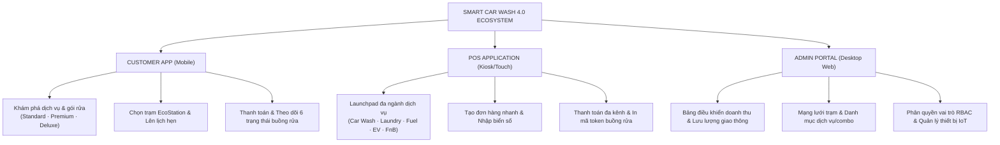

# Smart Car Wash 4.0 — Multi-Service Customer App · POS · Operations Platform
> **CodeGraph Master Knowledge Base & Architecture Document**  
> *Dự án hệ sinh thái đa bề mặt: Ứng dụng Khách hàng Mobile, Giao diện POS tại trạm và Cổng quản trị Admin vận hành.*

---

## 📌 1. Project Positioning & Executive Summary

- **Project Title:** Smart Car Wash 4.0
- **Subtitle:** Multi-Service Customer App · POS · Operations Platform
- **Alternative:** A connected service ecosystem across customer, point-of-sale, and administration workflows.
- **Slug Kỹ thuật:** `smart-car-wash` (Index: `06`)
- **Product Type:** Multi-Service Platform
- **Role:** UI/UX Support (Multi-surface design)
- **Category:** `Internal Operations` / `Multi-Surface Platform`
- **Domain:** Car Care · EV Charging · Service Operations
- **Platforms:** Customer Mobile App · POS Application · Admin Portal
- **Nguồn Figma thực tế:** `ASrpZZ44o3RPKX2UgUhBkU`, Node `480:7633` (CarWash)
- **Tài sản hình ảnh:** `public/projects/smart-car-wash/` (29 file WebP & PNG thực tế trích xuất từ Figma)

### Định vị năng lực khác biệt (Differentiator):
Dự án chứng minh tư duy thiết kế hệ sinh thái đa bề mặt (**Multi-surface product design**):
1. **Customer Mobile App:** Trải nghiệm dịch vụ cá nhân, quy trình có hướng dẫn (Guided), mật độ thông tin thấp, tập trung khám phá, đặt lịch và theo dõi tiến trình trực tiếp.
2. **POS Application:** Trải nghiệm tại quầy dành cho nhân viên, không gian làm việc rộng, tối ưu tốc độ thao tác (Task-oriented), hỗ trợ thanh toán đa kênh (VietQR, thẻ chạm NFC, tiền mặt).
3. **Admin Portal:** Cổng quản trị điều hành, mật độ dữ liệu cao (Dense Data), bảng biểu tra cứu, cấu hình gói sản phẩm, phân quyền vai trò (RBAC) và quản lý thiết bị phần cứng IoT / POS.

---

## 🏗️ 2. Hệ Sinh Thái Dịch Vụ: "One Service Ecosystem, Three Working Contexts"



---

## 🔄 3. Bóc Tách Các Luồng Nghiệp Vụ Cốt Lõi

### 3.1. Customer Service Journey (7 Bước)
1. **Khám phá dịch vụ:** Xem danh mục trạm, gói rửa và ưu đãi trên trang chủ.
2. **Chọn gói rửa:** So sánh quyền lợi Standard, Premium, Deluxe theo phân loại xe (Sedan, SUV).
3. **Chọn trạm & vị trí:** Tìm trạm EcoStation gần nhất theo bán kính địa lý.
4. **Lên lịch hẹn:** Chọn ngày và khung giờ trống để tránh xếp hàng chờ tại trạm.
5. **Xác nhận & Thanh toán:** Thanh toán nhanh qua VietQR, thẻ thanh toán hoặc điểm thưởng EcoPoint.
6. **Theo dõi quy trình:** Cập nhật trực tiếp tiến trình buồng rửa theo từng công đoạn.
7. **Lịch sử & Đánh giá:** Tra cứu hóa đơn điện tử và gửi phản hồi chất lượng.

### 3.2. 6 Giai đoạn Trạng thái Dịch vụ Thực tế (Physical Wash States)
- `STAGE 1: Check-in` — Xác nhận xe vào vị trí buồng rửa và quét mã token.
- `STAGE 2: Rửa ngoài` — Phun bọt tuyết hoạt tính và xịt áp lực cao thân vỏ.
- `STAGE 3: Rửa trong` — Hút bụi nội thất và lau sạch chi tiết kính & cabin.
- `STAGE 4: Sấy khô` — Hệ thống quạt sấy công suất lớn làm khô bề mặt.
- `STAGE 5: Kiểm tra` — Kỹ thuật viên đối soát chất lượng hoàn thiện trước khi bàn giao.
- `STAGE 6: Hoàn tất` — Gửi thông báo hoàn thành tới app và mời khách nhận xe.

### 3.3. POS Attendant Workflow (Quầy Dịch Vụ)
```
Ngành dịch vụ → Chọn gói rửa → Nhập biển số xe → Thêm giỏ hàng → Xác nhận đơn → Thanh toán (VietQR/Thẻ/Tiền mặt) → Hoàn tất & In Token
```

### 3.4. Admin Operational Modules
- **Analytics:** Revenue Dashboard, Transaction Logs, Activity Logs.
- **Operations:** Locations Registry, Active Service Verticals, Global Vehicle Registry, Product & Combo Catalog, Booking Calendar.
- **Access / Customers:** Roles & Permission Matrix (RBAC), System User Accounts, Loyalty Member & Tiers, Voucher Schemes.
- **System / Hardware:** POS Terminals, Terminal Allocations, IoT Gateway Infrastructure, Global Settings.

---

## 🗂️ 4. Danh Mục Tài Sản Hình Ảnh Figma Thật (Asset Registry)

Thư mục: `public/projects/smart-car-wash/`

| File Name | Node ID Figma | Tên Màn Hình / Ý Nghĩa Nghiệp Vụ | Tỷ Lệ Khung Hình |
| :--- | :--- | :--- | :--- |
| `01-cover.webp` | *Composite* | Bố cục tổng thể 3 bề mặt: Mobile + POS + Admin | `16/10` |
| `customer-01-home.webp` | `130149:763` | Trang chủ Mobile App khách hàng | `mobile` (9/16) |
| `customer-02-wash-service.webp` | `130149:923` | Màn hình Rửa xe ngay / Gói dịch vụ | `mobile` (9/16) |
| `customer-03-select-station.webp` | `130151:1571` | Màn hình Chọn Trạm EcoStation | `mobile` (9/16) |
| `customer-04-select-datetime.webp` | `130151:1399` | Màn hình Chọn Ngày & Giờ | `mobile` (9/16) |
| `customer-05-booking-confirm.webp` | `130151:1711` | Màn hình Xác nhận Đặt lịch | `mobile` (9/16) |
| `customer-06-payment.webp` | `130149:1009` | Màn hình Thanh toán | `mobile` (9/16) |
| `customer-07-tracking-process.webp` | `130151:1879` | Màn hình Theo dõi Quy trình Rửa (6 States) | `mobile` (9/16) |
| `customer-08-order-history.webp` | `130151:2145` | Màn hình Lịch sử Đơn hàng | `mobile` (9/16) |
| `pos-01-home.webp` | `130221:15940` | Giao diện POS Màn hình chính | `16/10` |
| `pos-02-carwash.webp` | `130221:16070` | Giao diện POS Chọn gói Rửa xe & Biển số | `16/10` |
| `pos-03-cart.webp` | `130221:16268` | Giao diện POS Thêm giỏ hàng | `16/10` |
| `pos-04-build-request.webp` | `130221:16528` | Giao diện POS Chi tiết yêu cầu | `16/10` |
| `pos-05-payment.webp` | `130221:17111` | Giao diện POS Thanh toán đa phương thức | `16/10` |
| `pos-06-success.webp` | `130221:17329` | Giao diện POS Giao dịch thành công | `16/10` |
| `pos-07-ev-charging.webp` | `130221:17908` | Giao diện POS Trạm sạc xe điện EV | `16/10` |
| `admin-01-revenue-dashboard.webp` | `130234:22219` | Admin Revenue Dashboard | `16/10` |
| `admin-02-transaction-logs.webp` | `130234:22588` | Admin Transaction Logs | `16/10` |
| `admin-03-locations-registry.webp` | `130234:23085` | Admin Locations Registry | `16/10` |
| `admin-04-product-catalog.webp` | `130234:24116` | Admin Product & Combo Catalog | `16/10` |
| `admin-05-roles-permissions.webp` | `130234:24661` | Admin Roles & Permission Matrix (RBAC) | `16/10` |
| `admin-06-pos-terminals.webp` | `130297:927` | Admin POS Terminals Management | `16/10` |
| `admin-07-iot-gateway.webp` | `130234:26224` | Admin IoT Gateway Registry | `16/10` |
| `design-system-01-colors.webp` | `130395:1917` | Design System: Color Tokens | `16/10` |
| `design-system-02-typography.webp` | `130395:2000` | Design System: Typography Scale (Inter) | `16/10` |
| `design-system-03-spacing-radius.webp` | `130395:2035` | Design System: Spacing & Radius Scales | `16/10` |
| `design-system-04-buttons.webp` | `130405:66` | Design System: Button Components | `square` |
| `design-system-05-inputs.webp` | `130409:67` | Design System: Input Field Components | `square` |
| `design-system-06-badges.webp` | `130413:58` | Design System: Badge & Tag Components | `square` |
| `design-system-07-cards.webp` | `130417:73` | Design System: Card Components | `square` |

---

## 💻 5. Code Mapping Trong Codebase

1. **Central Data Model:** [`src/data/projectsData.js`](file:///d:/Code/Profile/Portfolio/src/data/projectsData.js) (slug: `smart-car-wash`)
2. **Song ngữ I18n & Captions:** [`src/data/projectsI18n.js`](file:///d:/Code/Profile/Portfolio/src/data/projectsI18n.js)
3. **Trang Case Study Chi tiết:** [`src/pages/CaseStudyPage.jsx`](file:///d:/Code/Profile/Portfolio/src/pages/CaseStudyPage.jsx) (8 Chapters đầy đủ)
4. **Modal Xem Nhanh:** [`src/components/ProjectModal.jsx`](file:///d:/Code/Profile/Portfolio/src/components/ProjectModal.jsx)
5. **Fallback Cover Rule:** [`src/data/portfolioData.js`](file:///d:/Code/Profile/Portfolio/src/data/portfolioData.js) (`'smart-car-wash': null`)
