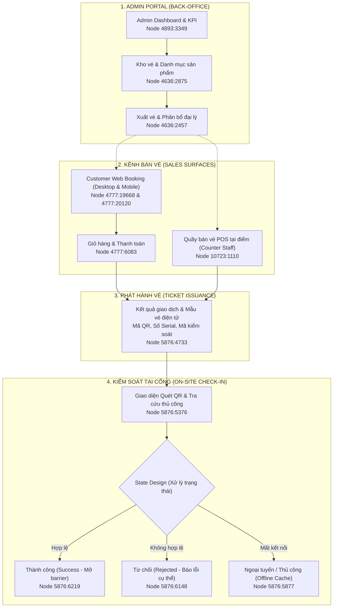

# Tourism System — Booking, Ticketing & On-site Operations
> **CodeGraph & Project Knowledge Base**  
> *Tài liệu phân tích kiến trúc đa bề mặt (Multi-Surface Ecosystem), vòng đời tấm vé khép kín (End-to-End Lifecycle), cấu trúc dữ liệu và liên kết mã nguồn (CodeGraph).*

---

## 📌 1. Project Positioning & Executive Summary

- **Project Title:** Tourism System — Booking, Ticketing & On-site Operations
- **Short Title:** Tourism System
- **Project Slug:** `tourism-omnichannel` *(Giữ nguyên slug kỹ thuật để đảm bảo routing)*
- **Index:** `04` (Featured Project)
- **Role:** UI/UX Designer — Product Support *(Không tuyên bố quyền sở hữu toàn bộ sản phẩm)*
- **Product Type:** Multi-Surface Tourism & Ticketing Ecosystem
- **Category:** `Travel & Booking`
- **Domain:** Tourism · Ticketing · On-site Operations
- **Platforms:** Admin Portal · Customer Web Booking · Counter POS · Ticket Issuance · Check-in Validation
- **Figma Source:** `quw3VbrY0atrG9YTyZRTwR` (Page `796:42` — Khu du lịch)

### 🎯 Bản chất khác biệt của dự án (What makes this project unique?)
Khác với **Vevuive** (tập trung vào B2C booking, discovery, bảo hiểm du lịch) hay **Kho MA** (quản trị kho vé nội bộ và luồng hoàn/hủy đa vai trò), **Tourism System** là một hệ sinh thái kết nối **5 bề mặt sản phẩm liên hoàn (Connected Multi-Surface Ecosystem)**:
1. **Admin Portal:** Bảng điều khiển quản trị, KPI doanh thu, mạng lưới đối tác và kho vé trung tâm.
2. **Customer Web Booking:** Trang chi tiết khu vui chơi, chọn ngày, số lượng khách và thanh toán trực tuyến.
3. **Counter POS:** Giao diện cảm ứng tối ưu thao tác nhanh cho nhân viên tại quầy vé vật lý.
4. **Ticket Issuance:** Phát hành vé điện tử chuẩn hóa tích hợp mã QR động, mã kiểm soát và số serial.
5. **On-site Check-in:** Xác thực vé tại cổng barrier bằng camera quét QR hoặc tra cứu mã thủ công.

---

## 🏗️ 2. Connected Multi-Surface Architecture & Ticket Lifecycle



---

## 🗂️ 3. CodeGraph: File Structure & Code Mapping

Dự án Tourism System được đồng bộ qua các tệp tin trong codebase:

```
Portfolio/
├── public/projects/khu-du-lich/            # Thư mục chứa 12 ảnh WebP chuẩn trích xuất từ Figma
│   ├── 01-cover-tourism-system.webp        # Cover composition (05 Desktop + 08 POS + 09 Ticket UI)
│   ├── 02-admin-dashboard.webp             # Node 4893:3349
│   ├── 03-product-ticket-inventory.webp    # Node 4636:2875
│   ├── 04-ticket-allocation.webp           # Node 4636:2457
│   ├── 05-attraction-detail-desktop.webp   # Node 4777:19668
│   ├── 06-attraction-detail-mobile.webp    # Node 4777:20120
│   ├── 07-booking-cart.webp                # Node 4777:6083
│   ├── 08-pos-counter-sale.webp            # Node 10723:1110
│   ├── 09-ticket-issued.webp               # Node 5876:4733
│   ├── 10-checkin-validation.webp          # Node 5876:5376
│   ├── 11-checkin-states.webp              # Composite (Frames 5876:5376, 5876:6219, 5876:6148, 5876:5877)
│   └── 12-ticket-lifecycle.webp            # Ecosystem composite (03 + 05 + 08 + 09 + 10)
│
├── src/
│   ├── data/
│   │   ├── projectsData.js                 # Định nghĩa dữ liệu dự án 04 (slug: "tourism-omnichannel")
│   │   │                                   # 8 chương bài toán sản phẩm + mảng 12 ảnh metadata
│   │   ├── projectsI18n.js                 # Bản dịch Tiếng Việt (vi) & Tiếng Anh (en) + 12 captions
│   │   └── portfolioData.js                # Category 'Travel & Booking', domainFallbackCovers = null
│   │
│   ├── pages/
│   │   └── CaseStudyPage.jsx               # Render Case Study chi tiết với 8 chương bài toán
│   └── components/
│       ├── ProjectModal.jsx                # Nhánh render `isTourismSystem` với đầy đủ 8 phân hệ
│       └── Portfolio.jsx                   # Render Card dự án trên trang chủ và trang danh mục
```

### Các Symbol & Data Key trong `projectsData.js`:
- `project.operationalSurfaces`: Bài toán 01 — 5 bề mặt sản phẩm liên kết (`surfaces` array).
- `project.productInventory`: Bài toán 02 — Bảng tồn kho và luồng xuất vé (`keyAreas` array).
- `project.bookableExperience`: Bài toán 03 — Trang chi tiết khu vui chơi (`features` array).
- `project.counterPos`: Bài toán 04 — Giao diện quầy POS (`posWorkflow` array).
- `project.ticketIssuance`: Bài toán 05 — Phát hành vé điện tử (`ticketElements` array).
- `project.checkinValidation`: Bài toán 06 — Kiểm tra vé tại cổng (`validationSteps` array).
- `project.checkinStates`: Bài toán 07 — State-oriented design (`states` array: Success, Rejected, Offline).
- `project.ticketLifecycleSection`: Bài toán 08 — Vòng đời 5 giai đoạn khép kín (`lifecycleSteps` array).
- `project.modules`: Danh sách 10 phân hệ chức năng thực tế.
- `project.images`: Mảng 12 đối tượng ảnh WebP chuẩn hóa.

---

## 🖼️ 4. Asset Inventory & Figma Node Mapping

| STT | Tệp WebP | Figma Node ID | Tên Frame / Layer | Vai trò & Ý nghĩa |
| :---: | :--- | :--- | :--- | :--- |
| **01** | `01-cover-tourism-system.webp` | Composite | Cover Art (05 + 08 + 09) | Ảnh bìa đại diện cho case study: Booking Web + POS Quầy + Vé điện tử. |
| **02** | `02-admin-dashboard.webp` | `4893:3349` | Trang chủ | Chương 01: Tổng quan vận hành, KPI thương mại, mạng lưới đại lý. |
| **03** | `03-product-ticket-inventory.webp` | `4636:2875` | Quản lý Kho vé | Chương 02: Quản lý SKU, serial, hạn ngạch phát hành/khả dụng/đã bán. |
| **04** | `04-ticket-allocation.webp` | `4636:2457` | Xuất vé cho đại lý | Chương 02: Quy trình phân bổ và xuất vé cho các kênh đối tác. |
| **05** | `05-attraction-detail-desktop.webp` | `4777:19668`| /detail_kvc → Desktop | Chương 03: Trang chi tiết khu vui chơi Desktop tập hợp thông tin & CTA. |
| **06** | `06-attraction-detail-mobile.webp` | `4777:20120`| /detail_kvc → Mobile | Chương 03: Tái cấu trúc trải nghiệm đặt vé dọc tối ưu cho thiết bị di động. |
| **07** | `07-booking-cart.webp` | `4777:6083` | /Giỏ-hàng → Desktop | Chương 03: Bối cảnh giỏ hàng kết nối việc chọn dịch vụ sang thanh toán. |
| **08** | `08-pos-counter-sale.webp` | `10723:1110`| Tạo đơn hàng / Giỏ hàng (POS) | Chương 04: Màn hình bán vé cảm ứng tại quầy cho thu ngân. |
| **09** | `09-ticket-issued.webp` | `5876:4733` | Kết quả giao dịch - In vé | Chương 05: Vé điện tử chứa QR code, số serial và nút in vé/gửi vé. |
| **10** | `10-checkin-validation.webp` | `5876:5376` | Kiểm tra Vé & Check-in | Chương 06: Màn hình kiểm tra vé tại cổng quét QR hoặc tìm thủ công. |
| **11** | `11-checkin-states.webp` | `5876:5877`<br/>`5876:6148`<br/>`5876:6219` | Trạng thái Check-in | Chương 07: Thiết kế đa trạng thái: Thành công, Từ chối và Chế độ ngoại tuyến. |
| **12** | `12-ticket-lifecycle.webp` | Composite | Tổng quan Vòng đời Vé | Chương 08: Sơ đồ tổng kết hệ sinh thái kết nối 5 bề mặt sản phẩm. |

---

## 🧭 5. Case Study Narrative Structure (Trục Kể Chuyện)

### Chapter 01 — Một Sản Phẩm, Đa Bề Mặt Vận Hành (Operational Surfaces)
- **Visuals:** `01-cover-tourism-system.webp`, `02-admin-dashboard.webp`
- **Thông điệp:** Khẳng định quy mô hệ sinh thái bao trùm Admin, Web Booking, Quầy POS, Phát hành vé và Soát vé cổng.

### Chapter 02 — Quản Trị Sản Phẩm & Tài Nguyên Vé (Product & Inventory Operations)
- **Visuals:** `03-product-ticket-inventory.webp`, `04-ticket-allocation.webp`
- **Thông điệp:** Phân cấp thông tin mật độ cao, cảnh báo sắp hết vé và quy trình nghiệp vụ cấp phát hạn mức vé đại lý.

### Chapter 03 — Trải Nghiệm Đặt Vé Khách Hàng (Customer Booking Experience)
- **Visuals:** `05-attraction-detail-desktop.webp`, `06-attraction-detail-mobile.webp`, `07-booking-cart.webp`
- **Thông điệp:** Gom truyền thông, chính sách và công cụ đặt vé vào một working context. Tái tổ chức bố cục linh hoạt trên mobile thay vì co nhỏ desktop.

### Chapter 04 — Thiết Kế Chuyên Biệt Cho Nhân Viên Tại Quầy (Counter POS)
- **Visual:** `08-pos-counter-sale.webp`
- **Thông điệp:** Phục vụ nhân viên bán vé thao tác dưới áp lực khách xếp hàng: duyệt nhanh dịch vụ, giỏ hàng luôn hiển thị, thanh toán đa phương thức.

### Chapter 05 — Từ Giao Dịch Đến Tấm Vé Sử Dụng (Ticket Issuance)
- **Visual:** `09-ticket-issued.webp`
- **Thông điệp:** Chuyển hóa đơn hàng thành vé sử dụng chứa QR code động, mã kiểm soát, dải số serial và hỗ trợ in vé nhiệt ngay tại quầy.

### Chapter 06 — Khép Lại Vòng Đời Tại Cổng Kiểm Soát (On-site Validation)
- **Visual:** `10-checkin-validation.webp`
- **Thông điệp:** Giao diện quét mã QR camera và tra cứu thủ công, đối soát thông tin khách và dịch vụ trước khi cho phép vào cổng.

### Chapter 07 — Thiết Kế Vượt Ra Ngoài Kịch Bản Lý Tưởng (State-Oriented Design)
- **Visual:** `11-checkin-states.webp`
- **Thông điệp:** Sẵn sàng cho thực địa: Trạng thái Thành công, Trạng thái Từ chối (nêu rõ lý do) và Chế độ hoạt động Ngoại tuyến khi mất mạng.

### Chapter 08 — Vòng Đời Tấm Vé Khép Kín (Ticket Lifecycle)
- **Visual:** `12-ticket-lifecycle.webp`
- **Thông điệp:** Tổng kết tính mạch lạc của toàn bộ hệ sinh thái sản phẩm.

---

## 🛡️ 6. Guardrails & Quy Tắc Cốt Lõi (Scope Lock)

1. **Tuyệt đối không dùng ảnh stock:** Không dùng ảnh du lịch phong cảnh chung chung từ Unsplash để thay thế giao diện sản phẩm. `domainFallbackCovers['tourism-omnichannel'] = null` đã được thiết lập.
2. **Không tự bịa chỉ số (metrics):** Không tự tạo % tăng trưởng doanh thu hay điểm số thử nghiệm người dùng không có căn cứ.
3. **Không nhận vơ quyền sở hữu:** Vai trò là `UI/UX Designer — Product Support`, thể hiện năng lực thiết kế hệ sinh thái và giải quyết bài toán giao diện phức tạp.
4. **Không lặp lại Vevuive hay Kho MA:** Vevuive tập trung vào B2C booking/bảo hiểm; Kho MA tập trung vào admin kho vé & hoàn huỷ; Tourism System tập trung vào tính liên kết giữa mua trực tuyến và vận hành tại điểm thực tế.
