# VEVUIVE — Web & Mobile Booking Platform
> **CodeGraph & Project Knowledge Base**  
> *Dự án nền tảng đặt vé vui chơi, tour du lịch và tích hợp bảo hiểm nhúng (BA + UX) trên Web & Mobile.*

---

## 📌 1. Project Positioning

- **Project Title:** VEVUIVE — Web & Mobile Booking Platform
- **Slug:** `vevuive` (Index: `02`)
- **Role:** UI/UX Designer (BA Contribution — Insurance Integration)
- **Category:** `Travel & Booking`
- **Domain:** Tourism · Booking · Ticketing · Embedded Insurance
- **Platforms:** Web · Mobile App (iOS / Android) · Admin
- **Assets:** `public/projects/vevuive/` (15 ảnh WebP trích xuất từ Figma)

---

## 🏗️ 2. User Journey & Feature Parity

```mermaid
flowchart LR
    subgraph DISCOVERY["1. KHÁM PHÁ (DISCOVERY)"]
        A1["Trang chủ Web / Mobile<br/>(02-home-desktop / 03-home-mobile)"]
        A2["Khám phá điểm đến & tour<br/>(04-explore-desktop / 05-explore-mobile)"]
        A3["Chi tiết dịch vụ<br/>(06-destination-desktop / 07-destination-mobile)"]
        A1 --> A2 --> A3
    end

    subgraph BOOKING["2. ĐẶT VÉ & BẢO HIỂM (TRANSACTION)"]
        B1["Chọn loại vé & ngày sử dụng<br/>(08-ticket-selection)"]
        B2["Giỏ hàng & Khuyến mãi<br/>(09-cart-voucher)"]
        B3["Thông tin khách hàng & BẢO HIỂM NHÚNG<br/>(10-checkout-insurance)"]
        A3 --> B1 --> B2 --> B3
    end

    subgraph FULFILLMENT["3. VÉ ĐIỆN TỬ & ĐƠN HÀNG (POST-BOOKING)"]
        C1["Thanh toán đa cổng<br/>(11-payment-methods)"]
        C2["E-ticket & Mã QR check-in<br/>(12-eticket-voucher)"]
        C3["Quản lý đơn hàng & hoàn hủy<br/>(13-order-management)"]
        B3 --> C1 --> C2 --> C3
    end
```

### Điểm nhấn BA + UX (Insurance Integration):
- Khách hàng không cần điền lại thông tin trùng lặp giữa vé và bảo hiểm.
- Logic kiểm tra điều kiện bảo hiểm (tuổi, quốc tịch) chạy ngầm và hiển thị điều khoản minh bạch trong luồng thanh toán.
- Giữ vững tính tương đương năng lực (Feature Parity) giữa Web Desktop và Native Mobile App.

---

## 🗂️ 3. Code Mapping

- **Data Definition:** [`src/data/projectsData.js:L509-L928`](file:///d:/Code/Profile/Portfolio/src/data/projectsData.js#L509-L928)
- **Localization:** [`src/data/projectsI18n.js:L71-L129`](file:///d:/Code/Profile/Portfolio/src/data/projectsI18n.js#L71-L129) (VI), [`L486-L544`](file:///d:/Code/Profile/Portfolio/src/data/projectsI18n.js#L486-L544) (EN)
- **Case Study View:** [`src/pages/CaseStudyPage.jsx:L985-L1230`](file:///d:/Code/Profile/Portfolio/src/pages/CaseStudyPage.jsx#L985-L1230)
- **Modal View:** [`src/components/ProjectModal.jsx`](file:///d:/Code/Profile/Portfolio/src/components/ProjectModal.jsx) (`isVevuive`)
- **Assets:** `public/projects/vevuive/` (01-cover đến 15-responsive-overview)
